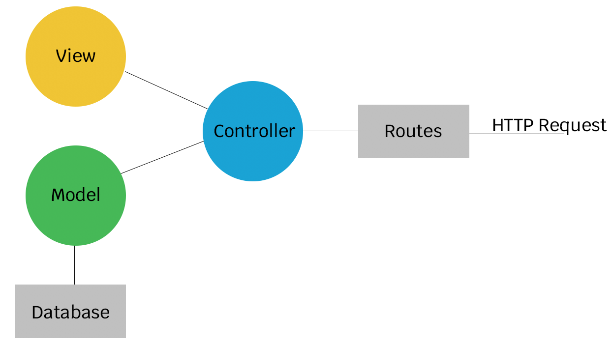
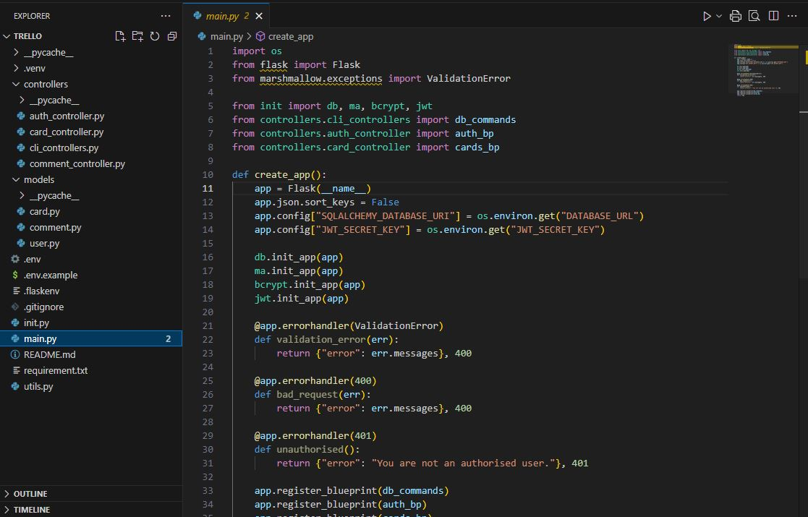
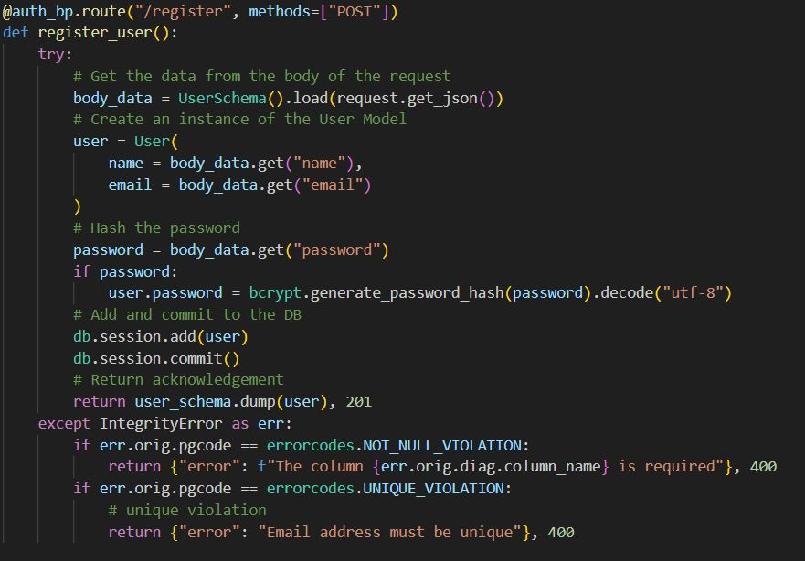
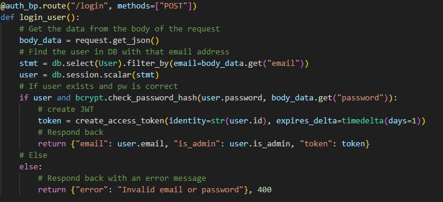
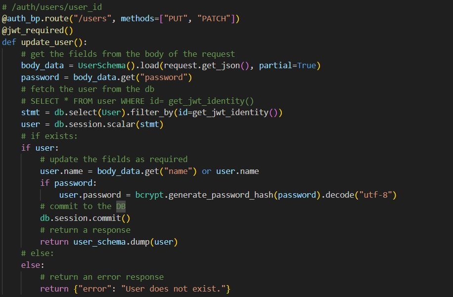
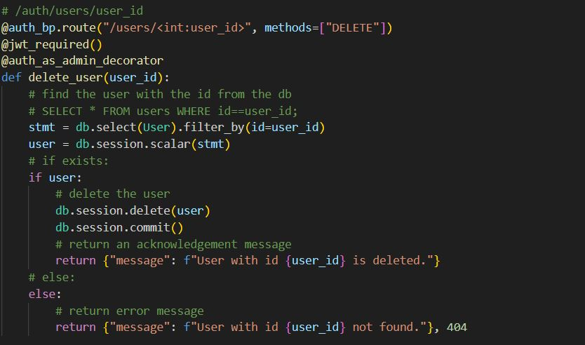
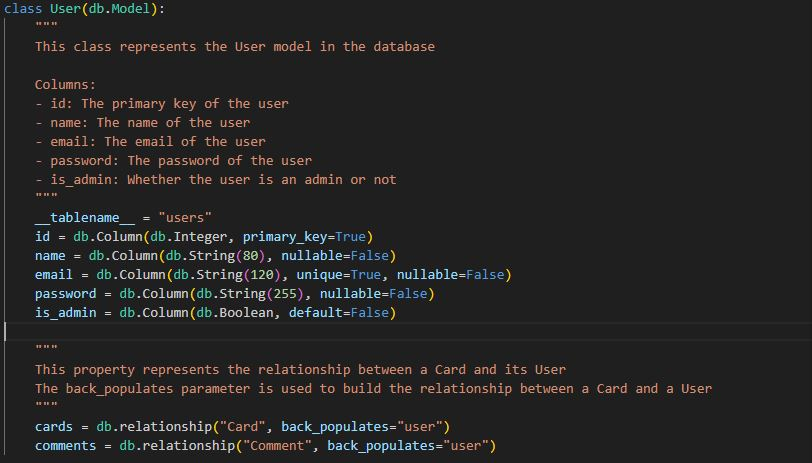
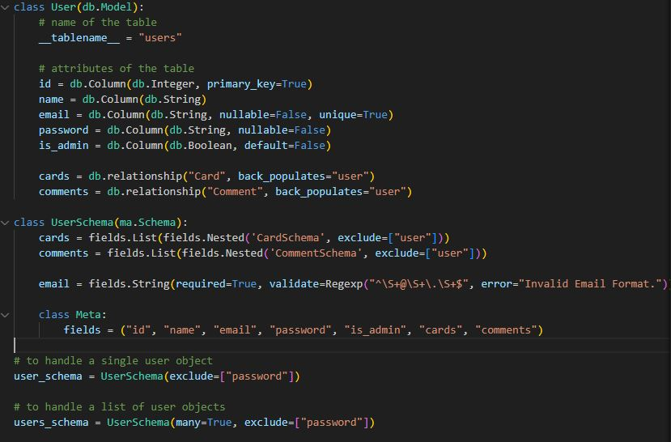
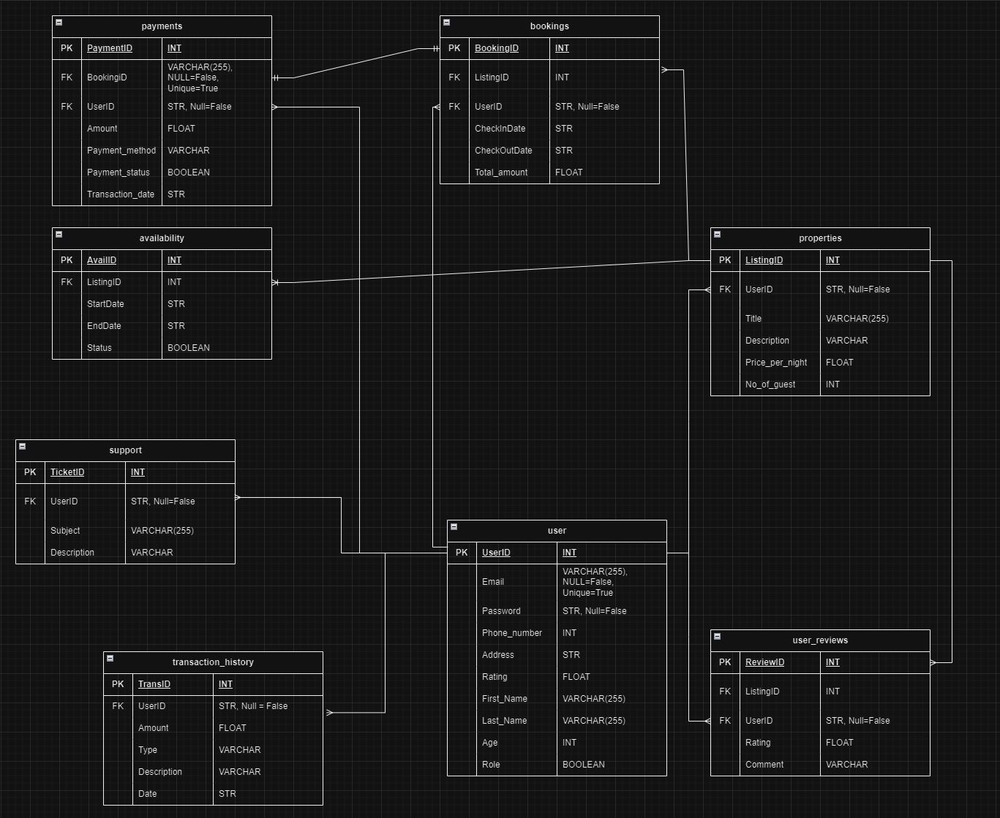

# T2A1-B WorkBook

## Table of Contents

1. [Describe the architecture of a typical API project, such as a Flask application.](#q1---describe-the-architecture-of-a-typical-api-project-such-as-a-flask-application)
2. [Identify a database commonly used in an API project (such as a Flask application) and discuss the pros and cons of this database.](#q2---identify-a-database-commonly-used-in-an-api-project-such-as-a-flask-application-and-discuss-the-pros-and-cons-of-this-database)
3. [Discuss an implementation of an Agile project management methodology for an API project.](#q3---discuss-an-implementation-of-an-agile-project-management-methodology-for-an-api-project)
4. [Provide an overview and description of a standard source control process for an API project.](#q4---provide-an-overview-and-description-of-a-standard-source-control-process-for-an-api-project)
5. [Provide an overview and description of a standard testing process for an API project.](#q5---provide-an-overview-and-description-of-a-standard-testing-process-for-an-api-project)
6. [Explain the three principles of information system security.](#q6---explain-the-three-principles-of-information-system-security)
7. [Provide an overview of what would need to be done within an API project to implement at least one of the principles explained in Question 6.](#q7---provide-an-overview-of-what-would-need-to-be-done-within-an-api-project-to-implement-at-least-one-of-the-principles-explained-in-question-6)
8. [Explain the legal obligations that developers of a social media website or social media application would have in regards to handling user data, with reference to any applicable laws or acts.](#q8---explain-the-legal-obligations-that-developers-of-a-social-media-website-or-social-media-application-would-have-in-regards-to-handling-user-data-with-reference-to-any-applicable-laws-or-acts)
9. [Describe the structural aspects of the relational database model.](#q9---describe-the-structural-aspects-of-the-relational-database-model-your-description-should-include-information-about-the-structure-in-which-data-is-stored-and-how-relations-are-represented-in-that-structure)
10. [Describe the integrity aspects of the relational database model.](#q10---describe-the-integrity-aspects-of-the-relational-database-model-your-description-should-include-information-about-the-types-of-data-integrity-and-how-they-can-be-enforced-in-a-relational-database)
11. [Describe the manipulative aspects of the relational database model.](#q11---describe-the-manipulative-aspects-of-the-relational-database-model-your-description-should-include-information-about-the-ways-in-which-data-is-manipulated-added-removed-changed-and-retrieved-in-a-relational-database)
12. [Conduct research into a web application (app)](#q12---conduct-research-into-a-web-application-app-and-answer-each-of-the-following-sub-questions)
13. [References](#references)


## Q1 - Describe the architecture of a typical API project, such as a Flask application.

The architecture of a typical API project, such as a Flask application, follows a modular and layered approach called the MVC paradigm. This is where web applications are seperated into different mnodules of an app, known as modularisation, based on the tasks that they complete. 



There three main components which MVC architecture seperates a Flask application are:

1. Model: Represents the data structure and business logic of the application. It manages the data and the rules for how that data can be accessed and manipulated. In a Flask application, this is typically done using an ORM (Object-Relational Mapping) tool like SQLAlchemy to define and manage the database tables and relationships.

2. View: This is responsible for presenting data to the user.

3. Controller: Acts as the intermediary between the Model and the View. It receives input from a user or client, processes that input by interacting with the model, and determines what data should be presented to the user via the View. [[1]](https://edstem.org/au/courses/16448/lessons/52032/slides/354142)

Below is a detailed breakdown of the components in a Flask API application architecture that applies the MVC paradigm, covering key elements of the project:

#### 1. Project Structure

A well-organized project structure is essential for maintaining readability, scalability, and ease of development. A common structure might look like this:



#### 2. Main Components of the Application

**Entry Point (```main.py```)**
This file serves as a file where the Flask application is initialized and run. It will import the Flask app from other modules such as init.py and start a web server.

        from flask import Flask

        def create_app():
            app = Flask(__name__)
            
            # Configurations
            app.config.from_object('config.Config')

            # Initializations
            init_app(app)
            
            # Register Blueprints
            app.register_blueprint

            return app

This will essentially be importing objects from within files such as ```__init__.py``` file, and imports blueprints from controllers and registering them usuable as commands and routes.

**App Initialization (```__init__.py```)**
The ```__init__.py``` file inside the app/ directory is the main function responsible for creating a new flask instance for registering routes, and initializing configuration, database, and other services.

        from flask import Flask

        def create_app():
            app = Flask(__name__)
            
            # Configurations
            app.config.from_object('config.Config')

            # Initializations
            init_app(app)
            
            # Register Blueprints
            app.register_blueprint

            return app

- Configuration: Inputs in the #configurations will load any settings available a configuration file or/and environment such as JWT tokens and connecting to the database
- Initializations: Allows the initialization of certain objects for the API such as databases, marshmallow, Bcrypt and JWTManager.
- Blueprints: These are modular components that allow breaking the app into smaller, reusable parts which are necessary for the usage of database commands and controllers.

**Models (```models.py```)**
Models define the database schema using an ORM (Object-Relational Mapping) like SQLAlchemy. Each model corresponds to a database table allowing the creation of a database and defines atrributes/values. [[2]](https://medium.com/@clarazheng111/model-view-controller-5c1f16f23947)

        from init import db, ma
        from marshmallow import fields
        from marshmallow.validate import Regexp

        # Model
        class User(db.Model):
            __tablename__ = "users"
            
            # Attributes of the table
            id = db.Column(db.Integer, primary_key=True)
            username = db.Column(db.String(80), unique=True)
            email = db.Column(db.String(120), unique=True)

        # Schema
        class UserSchema(ma.Schema):

By importing instances such as SQLAlchemy(ORM) from the init.py file, users are able to turn SQL queries into Python classes and methods to create and define a data table.

- Model: This will contain the name of the table created.
- Attributes: Contains values and elements of a database that is inputted by the user.
- Schema: It is an extension used to serialize and deserialize data into python readable data.

**Controllers (```controllers.py```)**
Controllers contain the business logic that interacts with models and processes data before sending it to routes. These files can be modularised making a project more readable and organized. Controller files can be modularised to have different functions such as: [[2]](https://medium.com/@clarazheng111/model-view-controller-5c1f16f23947)

**Cli (command-line interface) Controller**: Contain commands that are created to perform operations such as CREATE, SEED, annd DROP.

- ```CREATE```: Creates a table ```@db_commands.cli.command("create")``` 
- ```SEED```: Creates a seed of data into the database into the Model ```@db_commands.cli.command("seed")```
- ```DROP```: Removes a table(s). ```@db_commands.cli.command("drop")```

**Auth Controller**: This file will contain routes for authentication such as token creates for logins and registrations.

Other general controllers will contain functions to utilize and initalize functions, **routes** handle client requests and returns data/responses to the client as JSON format. Otherwise is the endpoint of an API. For example:

- ```GET```: Fetch data/values from within a database ```@cards_bp.route("/")```
- ```POST```: Creates new values into a database ```@cards_bp.route("/", methods=["POST"])```
- ```DELETE```: Delete data from within a specific database ```@cards_bp.route("/<int:card_id>", methods=["DELETE"])```
- ```PUT/PATCH```: edits an existing single or whole value/data within the database ```@cards_bp.route("/<int:card_id>", methods=["PUT", "PATCH"])```

For example:

        @cards_bp.route("/", methods=["POST"])
        @jwt_required()
        def create_card():
            # get the data from the body of the request
            body_data = card_schema.load(request.get_json())
            # create a new card model instance
            card = Card(
                title = body_data.get("title"),
                description = body_data.get("description"),
                date = date.today(),
                status = body_data.get("status"),
                priority = body_data.get("priority"),
                user_id = get_jwt_identity()
            )

## Q2 - Identify a database commonly used in an API project (such as a Flask application) and discuss the pros and cons of this database.

One of the most commonly used databases in API projects, such as those built with Flask, is **PostgreSQL**. PostgreSQL is a powerful, open-source, object-relational database system created back in 1986 as part of the **POSTGRES project** at the University of California [[3]](https://www.postgresql.org/about/) that supports SQL (structure query language). It is widely regarded for its flexibility, reliability, and robust feature, making it a popular choice for both small and large-scale applications and runs on all operation 'major' operating systems such as Linux, macOS and Windows. Within a Flask application, PostgreSQL is used as a primary relational database for storing user data, posts, transactions, logs and/or any other structured data such as e-commerce, analytics, web applications and more.

### Pros of PostgreSQL

- **Open Source & Community**: PostgreSQL is open-sourced and free to use, and modify making it higherly extensible. With a large open source community supporting and updating it continously with improvements, patches and documentations, making it a cost-effective solution for many corperations and developers are able to easily find resources, plugins and support.

- **ACID Compliance and Strong Transaction Support**: From 2001, PostgreSQL supports and complies with ACID, short for Atomicity, Consistency, Isolation and Durability principles. This can be applied to transactions such as bank transactions due to the high integrity and consistency of data which is critical for applications that require reliable safe transactions. These guarantees are made without database locks and errors using **Multiversion Concurrency Control (MVCC)**, by allowing data to be processed simutaneously without interference. [[4]](https://www.techtarget.com/searchdatamanagement/definition/ACID)

- **Extensibility**: Allows users to define custom and/or complex data types, operators and index types, which provides flexibility when creating a database. Such data types include: JSON, arrays, ranges, and more. This will also include advanced querying capabilities such as complex joins, window functions and support queries, making it versatile that require complex analytics or handling of complex data relationships.

- **Reliability**: Uses **WAL (Write-ahead Logging)** [[5]](https://www.postgresql.org/docs/current/wal-intro.html), which is a standard method ensuring data integrity. Any changes to a data file does not need to be fully committed to prevent errors within a database. This makes it possible the recovery of a database back to it's initial state before the changes.

- **Scalability**: It is proven to handle and manage large-scale applications with extensive datasets and workloads. It is also designed to scale both vertically and horizontally, allowing it to handle increasing workloads, distributing to multiple servers.

- **Security Features**: Comes with a robust security feature such as authentication via MD5 and SCRAM-SHA-256, role-based access control, row-level security, and audit logging(Multi-Factor Authentications). [[6]](https://www.aalpha.net/blog/pros-and-cons-of-using-postgresql-for-application-development/)

### Cons of PostgreSQL

- **Drawbacks of Open Source**: Because PostgreSQL is an open-sourced application, it cannot be liable by any organization. In addition, because it is managed by the community, there potentially may contained shared code that may lack some user-friendly interfaces or features which is percieved too difficult for less-experienced developers that have no exposure to using PostgreSQL, and it may also not be compatible with the user's system software and/or hardware.

- **Database Structure**: PostGres is used as a relational database, meaning it requires a defined schema with specific rules to store data in a table. As each table is predefined, all records must adhere to that specific schema, therefore not allowing any flexibility to add extra fields without affecting other elements in the table. 

- **Performance Issues**: It's performance is considered slower compared to other relational database management system (RDBMS) such as mySQL.

- **User-Friendly**: Installing PostgreSQL and setting up it's configurations may be difficult for beginners. [[6]](https://www.aalpha.net/blog/pros-and-cons-of-using-postgresql-for-application-development/)

## Q3 - Discuss an implementation of an Agile project management methodology for an API project.

**Agile Project Management** or **Agile Methodology** has become a popular and dominate methodology for software development projects, due to its focus on flexibility, collaboration, and fast iterative progress. Implementing Agile is an API project ensures the continuous delivery of features, change in requirements and quality output from customer feedback and collaboration amongst other members and stakeholders (iteration). [[7]](https://www.atlassian.com/agile/project-management)

Examples to the implementation of Agile Methedology are; **Scrum** & **Kanban**.

Each of these methodologies shares common Agile principles, such as iterative development, continuous feedback, and collaboration. However, they differ in how they structure work and manage the development process. Below is an in-depth exploration of how these methodologies can be implemented in an API project.

### Scrum (Spotify)

**Scrum** is an Agile framework that focuses on fixed-length iterations, called sprints, and emphasizes team collaboration, roles, and structured meetings. 

Spotify employs Agile framework, specifically Scrum, for its API development and microservices. Their teams, known as squads, are self-organizing and operate with minimal supervision or external interference. These squads work in short sprints to deliver API endpoints that power features such as music recommendations, playlists, and user interactions. The use of Scrum enables Spotify to rapidly implement updates and improvements based on user feedback. [[8]](https://www.atlassian.com/agile/agile-at-scale/spotify)

This is how Scrum is implemented into Spotify's model: [[9]](https://engineering.atspotify.com/2021/05/achieving-team-purpose-and-pride-with-scrum/)

1. **Backlog**: The team and/or product leader creates a backlog of API features and functionalities and were written as user stories or technical tasks. It was done with refinement meetings to assign and understand each story, knowing each commitment for the sprint and track progress effectively.

2. **Spring planning**: The planning consists of creating sprints with the knowledge of which stories will need to be prioritized to ensure the delivery of each story is on time. By having a better understanding and preperation of each backlog ahead of time, it can be discussed, implemented and reviewed efficiently. An example of this can include tasks like implementing an endpoint of the API project.

3. **Sprint Review**: At the end of each sprint, it is reviewed by the team to demonstrate the features, collect feedback and adjust either any errors or improvements needed for that task/feature. During a review, there could be aspects of the sprint that will bring up questions such as:
    - What was completed?
    - What else is there to do?
    - Are we on track to completing and reaching the end goal of the project?

4. **Retrospectives (Retro)**: After the review, the team will hold meetings and collaboration to discuss concerns, what went well and what can be improved on. By the end of each retro, the team will have an implementable action item that can be tracked throughout the next sprints of the project.

5. **Stand-ups**: Stand-ups can be short meetings on a day-to-day basis to discuss with team members what they did on the day or the previous day and make any adjustments needed to unblock any team member's progress towards a sprint. Questions that can be discussed within each stand-up include:
    - How likely are we to complete this sprint?

### Kanban (Trello)

**Kanban** is another Agile Methodoloogy, focusing on continuous delivery without any fixed-length sprints, visualizes the workflow and limits the amount of work that can be in progress at any given time through limiting work-in-progress (WIP). Work is represented on Kanban boards, allowing the team to optimize their workflow and deliver across multiple teams within a single envinronment. [[10]](https://businessmap.io/kanban-resources/getting-started/what-is-kanban)

Below is an example of the application of Kanban: [[11]](edstem.org/au/courses/16448/lessons/52011/slides/354002)


The principles within a **Kanban Agile Framework** are: [[12]](https://trello.com/templates/engineering/kanban-dev-board-lvRpONOJ)

1. **Work Visualization**: By visualization a workflow, this will help the team and developers to better understand the state of a particular task. It can be easily organized by moving around each task to its corresponding progress such as; To do, Doing, Testing, Completed/Done. For example, a developer finishes coding a feature for a library database, they can move the task into either testing or done depending on the team's workflow.

2. **Work-In-Progress (WIP) Limits**: This will ensure the team only works on a set number of tasks at once and prevent overloading work which may result in subpar progress. As a team, if one member of a team finishes with their tasks, they can view the kanban board and help the other members with their tasks before starting a new task. For example, the limit of task to be done at one time can be set to 3, which means a new task cannot be started until those three tasks have been completed. Overall, this will reduce the total time it takes to start to finish of a task.

3. **Task Prioritization**: Applying the Kanban methodology, the team (generally the team lead) will provide a set of lists and labels on the board to priotize API tasks, such as developing new endpoints, improve security, or optimizing performances. This can be customized and adjusted accordingly, improving the workflow process in future projects.

4. **Pull (Don't Push) Work**: By using a pull-based system wheer the team members pull tasks into their workflow only when they have the capacity to handle them.

5. **Track Lead/Cycle Time**: This is a measurement of the total time spent a task spends being actively worked on from start to completion. The aim is to reduce cycle time to enhance the efficiency and flow of their process.


## Q4 - Provide an overview and description of a standard source control process for an API project.

A **Standard Source Control** process, also known as a **Version Control**, is a process of managing code, ensuring collaborative development and deployment of an API project. Source control systems such as **GIT** (free open-source control system) will provide a version management and help coordinate their work. [[13]](#https://www.atlassian.com/git/tutorials/what-is-version-control) The benefits to a source control is that is can provide protection to a code by: 

- Backing up to a remote location whether its private or public, which also prevents loss of files.
- Allows developer to backtrack through the history of code stored in the repository to either understand the code better, debug any errors or make improvements to the code.
- By creating multiple and merging branches allows individual developers to work independantly and make changes to a project without any conflict of work. Developers can choose to merge their branches and remove any unneccessary branches after testing is complete.

Examples of source control that implements these processes include APIs such as: [[14]](https://uk.indeed.com/career-advice/career-development/source-control)

- **GitHub**: GitHub allows team members of a project to work together and maintain all progress, workflow and history of changes to the project code. This will ensure any changes made within the project, can be undone if an error is made or implement/discuss improvements effectively between the team.

- **AWS CodeCommit**: This control system can also host Git repositories like GitHub and can easily connect with products to ensure the safety within the AWS environment of given code. It can also assist with securing access to different plugins from within AWS.

To implement the standard source control process to source control examples such as GitHub and AWS CodeCommit, it will include the processes such as: [[15]](#https://www.atlassian.com/git/tutorials/source-code-management)


1. **Repository Management**: Create and initialize a repository to manage the codebase for the API and adding files such as ```README.md```, ```.gitignore``` and the source code itself.
2. **Branching**: Creating multiple branches integrates ongoing development work and allow developers to work in the same project without any conflict of work that may affect other branches which can be merged into the main branch after completion.
3. **Commit and Push**: Commit to changes to the local branch of work with important and meaningful comments such as "implement user profile into model" and pushing the commitments to the branch inside the repository.
4. **Pull Requests**: A pull request is to allow the colloboration of other team members to review code, notify and provide feedback, and request changes if necessary.
5. **Merging**: This step is where developers bring together their individual working branches and merging them into one main parent branch.
6. **Issue Tracking**: This is generally the staging area used to collect a group of edits before writing them to a commit. Mainly used to refine any contents of the code and meets standards.
7. **Labelling**: Commenting and tagging versions to points of a repository allows developers to identify reference points to track issues, allows efficient debugging, and reduce risk of discrepancies between environments. [[16]](https://appinventiv.com/blog/wp-content/uploads/2018/08/Process-of-Version-Control-When-Using-Git.png)

## Q5 - Provide an overview and description of a standard testing process for an API project.

A **Standard Testing Process** is an essential process that evaluates and validates the reliability, security, performance and functionality of an API before it is released to production. The benefits of the testing process include: [[17]](https://www.browserstack.com/guide/what-is-api-testing)

- Ensure the API is working correctly
- Helps identify bugs, prompting for any debugging if necessary
- Enhances security by checking the API’s authentication, authorization, and data protection.
- Tests for performance metrics such as response times and making sure it runs efficiently.

The examples that will be explained are **Unit Testing** which can be done in applications such as **Insomnia** and **Stress Testing**. Although Insomnia does not have a built-in capability to do a stress test, there are other third party options such as **k6**, **locust** or **loader**. [[18]](https://docs.insomnia.rest/insomnia/unit-testing)

1. **Unit Testing**: A test that involves the testing of individual components or functions of an API in isolation to ensure they function correctly. These snippets of code include functions and/or methods such as; ```GET```, ```POST```, ```PUT```, ```PATCH``` & ```DELETE```. For example, to ensure the ```POST``` request is working in Insomnia, we will need to:

    - Create a new request
    - Configure the request by selecting the request type as ```POST```.
    - Enter the request URL for example: ```http://localhost:5000/create_user```
    - Request the body format, selecting JSON as the body type to **view**.
    - Set the body element that you want to test
    
            {
                "name": "Van Nguyen"
                "email": "van.nguyen@example.com
            }

    - Send the request and view the response to see whether the request had been successful or if an error appears.

There are multiple request responses that a user can receive. If the response is successful, it will respond with status of ```201 Created```. If it was unsuccessful, there may be a number of error responses that you may receive such as: [[19]](https://developer.mozilla.org/en-US/docs/Web/HTTP/Status)

- ```400 Bad Request```: The request was processed as invalid and generally percieved as a client error.
- ```401 Unauthorized```: The client must acquire authentication to be able to receive the requested response.
- ```500 Internal Server Error```

After receiving such errors, it can then be corrected and tested again until it is fully functioning.

2. **Stress Testing**: The reason for doing a stress test to identify for any weaknesses or vulnerabilities that may cause the system to perform poorly under extreme conditions and avoid any downtime caused under these conditions. The reliability of such systems as a business are crucial to ensure it's functionality in the real-world and meet customer expectations. 

To plan and perform a stress test, you will need to: [[19]](https://www.lambdatest.com/learning-hub/stress-testing)

- **Set the Objective**: Define and identify what you want to test and focus on that specific detail.
- **Configure and Run Tests**: Create the scenario and prepare the test environment to run the test. It can involve simulating real-life conditions, running multiple demands or subjecting it to different systems and hardware.
- **Analyze Results**: Monitor the test and analyze the results to identify any potential issues or failures during the test.
- **Optimize and Re-Test**: Based on the results of the test, implement any tweaks to improve the system and test again to ensure it meets the standards.
 
## Q6 - Explain the three principles of information system security.

The three principles of **Information System Security** are **Confidentiality, Integrity, and Availability** also known as the **CIA Triad**. These are essential for protecting information systems and ensuring that the data and resources are secure from any unauthorized access. [[20]](https://www.imperva.com/learn/data-security/information-security-infosec/#:~:text=of%20Digital%20Transformation.-,What%20are%20the%203%20Principles%20of%20Information%20Security%3F,are%20called%20the%20CIA%20Triad.)

### Confidentiality

Confidentiality refers to the intention to safeguard information from authorized access and disclosure. The aim is to protect and maintain the privacy of sensitive data, ensuring it is only accessible and is visible to individuals who either own or need it to perform their organizational functions and prevent any breaches from happening. This can be implemented with mechanisms including passwords, two factor authentication & biometric verification. In addition, encryption also fortifies security and help secure information from both accidental disclosures or malicious attacks. [[21]](https://securityscorecard.com/blog/what-is-the-cia-triad/)

For example:
In a healthcare system, patient records are highly confidential. Access to these records is restricted to authorized healthcare professionals only. Encryption is used to secure patient data both when it is stored in databases and when it is transmitted over networks.

### Integrity

Integrity is to ensure that the information/data can be trusted and it is accurate, consistent and unaltered by unauthorized invididuals to preserve the authenticity of such data. This can be maintained using techniques such as cryptographic hash functions or data checksums to ensure the audit and verification of the integrity of the data and it has not been comprised in any way during transmission and storage. [[22]](https://www.naukri.com/code360/library/cia-triad)

A data checksum is a string of characters that are either numbers and/or letters, is used to verify the integrity of data. By comparing the checksum of the original file with the one generated for your copy, you can confirm whether the file has been altered or not. [[23]](https://www.howtogeek.com/363735/what-is-a-checksum-and-why-should-you-care/) Similarly, a hash function is a fixed string of characters that is uniquely produced to the original data. If there is any slight modifications done to the data, it will result in a different hash. [[24]](https://www.hypr.com/security-encyclopedia/cryptographic-hash-function#:~:text=A%20cryptographic%20hash%20function%20(CHF)%20is%20an%20equation%20used%20to,size%20numerical%20string%20%E2%80%94%20the%20hash.)

For example:
A real-life example is how the voting system maintains the integrity of ballots to prevent election fraud. Similarly, a bank ensures that financial transactions are accurate for its customers. [[22]](https://www.naukri.com/code360/library/cia-triad)

### Availability

Availability is a means to ensure that the data and resources are accessible to an authorized user when needed. The principle of availability is to protect the system of potential hardware failures and cyberattacks and that data is stored safely. To ensure the resilience and achieve the principle of availability, you will need to implement:

- Load balancing and failover mechanisms to distribute traffic and prevent hardware/system failures.
- Implementing back up systems by implementing cloud-based solutions and disaster recovery plans which is a means to establish procedures to recover data and resume operations after a disruption or failure.
- Conducting regular system tests to prevent system failure and identify weaknesses/vulnerabilities within the system. [[25]](https://www.infosecurityeurope.com/en-gb/blog/guides-checklists/principles-of-information-security.html)

Example:
A real-life example is how a public library ensures the availability of its resources by staying open during regular hours. They provide access to its books and digital collections. Similarly, a power company ensures the availability of electricity to its customers. They give a dependable power grid and respond quickly to outages. [[22]](https://www.naukri.com/code360/library/cia-triad)


## Q7 - Provide an overview of what would need to be done within an API project to implement at least one of the principles explained in Question 6.

To implement the principle of **Confidentiality** within an API project, we can create an authorization controller ```auth_controller.py``` which will store sensitive information and use a cryptographic hash function such as ```bcrypt``` which will handle mechanisms such as encryption. This can be applied to an API project by implementing the 3 steps *(example of application is used in Trello API done in class)*: 

### Authentication
This step uses mechanisms such as OAuth2 or JSON Web Tokens(JWT) to verify a user's identify before granting them access to the database/system. In this example, it is handled through the usage of JSON Web Tokens.

The first step to implement authentication is through the registration of the user.



In this ```register``` route, when a user registers, their password will be hashed before being stored in the database using:

    user.password = bcrypt.generate_password_hash(password).decode("utf-8")

It will then be stored into the database which will include the user's data and password.

    db.session.add(user)
    db.session.commit()

After registering the user, the user will login using their registered information to ensure the accessibility of their account login.



During the login process, it will require the user to verify their password which is then compared to the hashed password stored within the database.

    if user and bcrypt.check_password_hash(user.password, body_data.get("password")):

After the password is confirmed correct, it will generate a JSON Web Token which is required for the next subsequent authentication request done by:

    token = create_access_token(identity=str(user.id), expires_delta=timedelta(days=1))

When the user receives their JSON Web Token, it is used to authenticate their privileges set for specific functions and is protected with a decorator  ```jwt_required```. For routes protected by the decorator  ```jwt_required```, if a user attempts to use a specific function, the route will extract the user's identify from the token provided and compare it to the database to ensure they meet the specific requirements and maintain secure, protected access. Overall, the authentication process is to ensure users have valid credentials to obtain a JSON Web Token which is then verified to gain access to user-specific data/functions.

### Authorization
This is implemented through the use of JSON Web Tokens(JWT) and decorators for admin checks and provides protection to unauthorized access in a Flask API.

By using the decorator from the ```flask_jwt_extended``` library, it ensures that the user must be authenticated and provide a valid token to access these endpoints. It will check the prescence and validity of the JWT in the request.

    from flask_jwt_extended import create_access_token, jwt_required, get_jwt_identity

The example below is a route that implements the principle of authorization using JSON Web Tokens:



In this route, ```@jwt_required()``` ensures that the user must have a valid JWT to update their information using the function ```PUT``` and ```PATCH```. If it is is invalid, it will return a response showing, ```'error: User does not exist.'``` 

Another example is the use of another decorator ```auth_as_admin_decorator``` shown in the example below in the ```delete user``` route. This is also an example of a role-based authorization where only user with a specific role is able to perform this function which is ```DELETE```.



The decorator ```auth_as_admin_decorator``` ensures that the user must be an administrative privileges to delete a user. How it works is that the decorator will check the user's role or permission to ensure they have the authory to perform the action.

### Encryption
Encryption is the implementation of mechanisms such as cryptographic hashing such as password hashing in the examples given before. By using the ```bcrypt``` library, we are able to hash passowrds before storing them into the database. It is a process where the original password input is transformed into a fixed-size string that cannot be reversed back. This will ensure if someone gains access to the database, they are unable to retrieve the password in text form.

As explained earlier, the use of the code below within the ```register``` will ensure that the password input from the user will be stored in the database as a hash string.

    if password:
        user.password = bcrypt.generate_password_hash(password).decode("utf-8")

To verify the password, the user will need to enter their password and it will be compared to the hash string stored in the database.

    if user and bcrypt.check_password_hash(user.password, body_data.get("password")):

Another form of encryption is formed through Token Creation. Even though JSON Web Tokens are not encrypted, they are encoded and signed to ensure their integrity and authenticity. Because a JWT includes a user's information, it is used to authenticate and authorize the user access to protected routes.

## Q8 - Explain the legal obligations that developers of a social media website or social media application would have in regards to handling user data, with reference to any applicable laws or acts.

In Australia, there are several legal laws and acts that developers of social media websites or applications must be aware and adhere to various legal obligations regarding handling of user data. These obligations are designed to protect the user's privacy and ensure their information is secure and protected from malicious acts. These acts include:

### Privacy Act 1988

The Privacy Act 1988 which includes the Australian Privacy Principles (APPs) was introduced to promote and protect the privacy of individuals. [[26]](https://www.oaic.gov.au/privacy/privacy-legislation/the-privacy-act) There is a total of 13 principles within the APP which is a framework designed to protect users. Below is a reference from the Office of the Australian Information Commissioner(OIAC) of the principles. [[27]](https://www.oaic.gov.au/privacy/australian-privacy-principles/australian-privacy-principles-quick-reference)


Under the Privacy Act 1988, there are guidelines which businesses and organisations must adhere including the collection, use and storage of personal information of their customers and are obligated to protect them from theft, misuse, interferences, loss, unauthorised access or modication of data. Under specific conditions, users have the rights to choose whether to not disclose their personal information or if the user no longer uses the services of an organisation, the organisation is obligated to delete the user's information to prevent further usage of such data. This will include information such as, name, contact number, credientials, health records, and more.

**Who is covered by the Privacy Act 1988?** [[28]](https://www.oaic.gov.au/privacy/privacy-legislation/the-privacy-act/rights-and-responsibilities)

1. Australian Government Agencies
2. Organizations with an annual turnover more than $3 million which is defined by:
    - an individual, including a sole trader
    - corporate
    - partnership
    - any other unincorporated association
    - trust.
3. Small businesses with an annual turnover of $3 million or less including:

    - private sector health service provider 
    - an employee association registered or recognised under the Fair Work 2020
    - credit reporting businesses
    - businesses that sell or purchases personal information for purposes such as marketing
    - any business registered under the consumer data right, privacy regulation 2013, or have opted-in to the Privacy Act.

Individuals or organizations who breach the Privacy Act 1988 will incur a penalty of 2,500,000 dollars for a person other than a body corporate and up to 50,000,000 dollars or three times the value of the benefit obtained directly or indirectly by the organization which is referenced under the Privacy Act Section 13G.

### Spam Act 2003

The purpose of the Spam Act 2003 is to regulate and combat unsolicitied commercial electronic messages also known as spam without the consent of the receiver via email and/or SMS. It is enforced by The Australian Communications and Media Authority(ACMA) and are responsible to enforce the Spam Act 2003. The ACMA has the authority to investigate complaints and impose penalties on individuals or organizations that breach the Act. Companies who have breached and been investigated by the ACMA include: [[29]](https://www.alrc.gov.au/publication/for-your-information-australian-privacy-law-and-practice-alrc-report-108/73-other-telecommunications-privacy-issues/spam-act/)

1. **Pizza Hut**: Sending marketing emails without consent, without contact details and without the option to unsubscribed received an infringement notice of $2,502,500.
2. **Luxottica Retail Australia Pty Ltd**: Sending emails without consent and without the option to unsubscribed received an infringement notice of $1,512,500. [[30]](https://www.acma.gov.au/investigations-spam-and-telemarketing)

**What constitutes as consent?** 

The implication of consent is seperated into two different types; 

1. **Express consent** 
It occurs when the recipient explicitly agrees to receive commericial electronic messages such as signing up for a newspaper by ticking on the box on a website to agree to receive marketing emails.

2. **Implied consent** 
This can be implied based on the relationship between the sender and the recipient. For example, consent can be inferred from certain electronic devices such as employees, directors or officers of an organization.

Recipients have the right to deny or retract their consent at any given time to not receive commericial messages by having an option to unsubscribe on their website/emails. Although, within the Spam Act 2003, it does not prohibit sending designated commercial messages as long as it contains factual information or is authorized by the Australian Government, educational institutions, religious organisations and charitable instituations, or messages related to goods or services. In addition, the sender must include their information including the individual's or organization's name, details and Australian Business Number (ABN) if applicable. 

## Q9 - Describe the structural aspects of the relational database model. Your description should include information about the structure in which data is stored and how relations are represented in that structure.

A **Relational Database Model** represents how data is stored in a relational database after it has been designed and visualized by creating an **Entity Relationship Diagram (ERD)**. [[31]](https://www.geeksforgeeks.org/relational-model-in-dbms/) It organizes data into tables, which represent entities, and uses relationships to define how these tables interact with each other. Here’s a detailed description of the structural aspects of the relational database model, including how data is stored and how relationships are represented. 

### Tables

Tables (also known as relations) are the fundamental building blocks of a relational database and is composed of:

- **Columns**: Represents the attibutes or fields of a table which is designated to store specific types of data. Each column can contain information such as a name, a data type and constraints.

- **Rows**: Represents the individual records or entries in a table also known as a tuple. Each row represents a unique record and contain data that corresponds to the column.

Example of a table: [[32]](https://raw.githubusercontent.com/Codecademy/docs/main/media/general-relational-database.png)


### Relation Keys

Relation Keys are used to identify a unique row which also helps to identify a specific table. The common type of keys used in a table include:

- **Primary Keys**: Primary Keys are the unique identifiers for each row in a table and is uniquely identified in each record. One of the properties of a primary key is that they cannot contain any ```NULL``` values. Using the example table above, in the ```Product``` table, the ```ModelNumber``` is the designated primary key as each ```ModelNumber``` is unique to that specific data/item ```ProductName```.

- **Foreign Keys**: Foreign Keys are used to bridge relationships between tables. A foreign key in one table points to a primary key in another table, establishing a connection between the two tables. A foreign key will ensure that the value of the column matches the value of the primary key column of a table. Following the previous example, a new table was created called ```Sales``` table. In this table, it consists of its own set of attibutes and tuples but also contains the ```ModelNumber``` column and because this column exist in its own primary table, it is considered a foreign key in the ```Sales``` table.

### Cardinality

Cardinality is a relationship between tables are represented through keys and are categorized into three main types also known as: [[33]](https://www.geeksforgeeks.org/introduction-of-er-model/)

1. **One-to-One**: In this relationship, each entity can only participate at most once in a relationship. This can be implemented by having a foreign key in one table that is also a primary key. For example, within a company that lends company cars to their employees, one employee can only be associated to one employee car.

2. **One-to-Many**: In a one-many relationship, an entity can be associated with multiple entities in another relationship. For example, a model number (Table B Foreign Key) of a product has many quantities, order dates and order numbers but is only associated to one model number (Table A Primary Key).

3. **Many-to-Many**: When multiple entities from one table can be associated with multiple entities in another table is called a many-to-many relationship. For example, if a student can apply and attend many courses and one of the courses can be taken by many students, that is considered to be a many-to-many relationship.

## Q10 - Describe the integrity aspects of the relational database model. Your description should include information about the types of data integrity and how they can be enforced in a relational database.

In the relational database model, data integrity refers to the accuracy, consistency, and reliability of the data stored in the database and is enforced through constraints. Integrity constraints are a set of rules that ensure processes are performed to not affect its data integrity whatsoever. Integrity is maintained through several integrity constraints such as: [[34]](https://www.geeksforgeeks.org/constraints-on-relational-database-model/)

### Entity Integrity

Entity Integrity ensures that each entity in a table is unique and identifiable by a primary key and that no primary key can have a ```NULL``` value. In the code:



The primary key is identified as the ```id``` in the code and it ensures that the relationship table of ```user``` has a unique identifier by enforcing ```primary_key=True```.

    id = db.Column(db.Integer, primary_key=True)

### Referential Integrity

Referential Integrity (constraint) refers to the relationships between tables and are bridged through the usage of foreign keys. Following the previous example in the ```user``` model, the ```user``` model establishes relationshjips with other models such as the ```card``` model and ```comment``` model. To enforce this constraint, foreign keys must be defined within the other models that references the primary key ```id``` in the ```user``` model.

For example, within the ```card``` model (```card.py```):

    cards = db.relationship("Card", back_populates="user")
    comments = db.relationship("Comment", back_populates="user")

And in the ```comment``` model (```comment.py```):

    card = db.relationship("Card", back_populates="comments")
    user = db.relationship("User", back_populates="comments")

This constraint will ensure that every ```card``` and ```comment``` entities is associated with the ```user```.

### Domain Integrity

A Domain Constraint ensures each value within an entity does not contain multiple values. To enforce this constraint, it requires the data type within a column to be limited to a value it can contain. For example: if an id number attribute is that of an integer, it cannot produce any other value types other than an integer.



A domain constraint can be applied to data types in the example code:

- ```id```: stored as an integer, it is set as the primary key of this model which is unique and cannot be ```NULL```.
- ```name```: stored as a string but does not have a limit in regards to the length of the string.
- ```email```: defined as a string and similar to the ```id```, it is specifically constrained with the rules of ```nullable=False, unique=True```. This means the email must contain a value and also is unique across other relationships/tables.
- ```password```: also defined as a string, it is constrained by the rules of ```nullable=False``` which means the password must contain a value.
- ```is_admin```: defined as a boolean with a default value of ```False``` to ensure users who register are not automatically set to have administration priviledges.
    
In conclusion, domain constraints enforces rules that are related to the data type, uniqueness and required fields of the user and ensures the data stored within the entity is consistent, following the rules of the constraint.

*Code referenced is from Trello API, covered in class.*

## Q11 - Describe the manipulative aspects of the relational database model. Your description should include information about the ways in which data is manipulated (added, removed, changed, and retrieved) in a relational database.

The manipulative aspects of the relational database model involves various ways to manipulate data which includes adding, removing, changing and retrieving using the data manipulation language (DML) statements. It is most commonly used in SQL and uses the four operations: [[35]](https://www.geeksforgeeks.org/what-is-sql/)

- ```SELECT```: to retrieve data from a database
- ```INSERT```: to add data into a database
- ```UPDATE```: to update and change data from within a database
- ```DELETE```: delete existing data in a database [[36]](https://edstem.org/au/courses/16448/lessons/52040/slides/354201)

Code snippet examples on how to use these operations:

### Retrieving

    # retrieve data from the column field "Departments"

    SELECT * FROM DEPARTMENTS; 

### Adding

    # add data into the table by choosing allocating where the data is going to be stored and what values do you want to store within that entity.

    INSERT INTO table_name(attr1, attr2, etc.) VALUES (attr1_value, attr2_value, etc.);

### Changing

    # change within the employees table, set the entity/field department_id to a different value

    UPDATE EMPLOYEES 
    SET department_id = 12;

### Removing

    # removes all values from within hour assignments entity

    DELETE FROM HOUR_ASSIGNMENTS;

To further manipulate data within a relational database using the four manipulative operatives, it can be used in conjunction to the following functions:

- ```JOIN```: Combine rows from two or more tables that is based on the related column.
- ```WHERE```: Filters rows.
- ```FROM```: Specifies the table(s) to be used. This function must be present at all time when using manipulative operations.
- ```GROUP BY```: Forms groups of rows with same column value.
- ```HAVING```: Filters groups subject to some condition.
- ```ORDER BY```: Specifies the order of the output.

In addition, we can manipulate data to perform mathematical calculations using aggregate functions such as: [[37]](https://edstem.org/au/courses/16448/lessons/52044/slides/354229)

- ```COUNT```: Returns the number of values in a specified column.
- ```SUM```: Returns the sum of values in a specified column.
- ```AVG```: Returns the average of the values in a specified column.
- ```MIN```: Returns the smallest value in a specified column.
- ```MAX```: Returns the largest value in a specified column 

An example of how to put all these operations and functions together to manipulate data within the example database:

    SELECT SUM(hours) 
    FROM HOUR_ASSIGNMENTS 
    WHERE project_id = 14;

To break down this example, we are specifically requesting/retrieving the ```sum``` of the data values from the entity ```hours``` in the table ```HOUR_ASSIGNMENTS``` where the entity ```project_id``` matches the value of 14 within the database. By using all this operations and functions together, we are able to navigate and manipulate data to the specific requirements of perform action(s) within a relational database.

## Q12 - Conduct research into a web application (app) and answer each of the following sub-questions:

The choice of research for a web application is Airbnb.

1. List and describe the software (tech stack) used by the app. [[38]](https://themewaves.com/airbnbs-tech-stack-the-programming-language-behind-the-worlds-largest-vacation-rental-marketplace/)


To describe some of the tech stacks involve to create this app will include software technologies such as: [[39]](https://intuji.com/airbnb-tech-stack-explained-airbnb-app/)

- **React** [[40]](https://www.w3schools.com/whatis/whatis_react.asp)
React is a User Interface (UI) library used to build UI components from the Front-End. There are two react frameworks that were used to develop Airbnb which are:

    - **React Native**: is used for building cross-platform mobile apps, allowing Airbnb to maintain a single codebase for both iOS and Android. This enables faster development and easier maintenance across platforms.
    - **React Storybook**: is another key tool for UI development, allowing developers to create and test UI components in isolation, ensuring consistency across different breakpoints and devices​. [[39]](https://intuji.com/airbnb-tech-stack-explained-airbnb-app/)

- **GraphQL** [[39]](https://intuji.com/airbnb-tech-stack-explained-airbnb-app/)
GraphQL is a query language for APIs, used to fulfill queries within an existing database from the Back-End. With GraphQL, it allows developers to precisely define the data required, resulting in the minimization of data transfers over the network and improve overall performances of the application.

- **Nginx** [[39]](https://intuji.com/airbnb-tech-stack-explained-airbnb-app/)
Nginx is an open-sourced web server software that manages HTTP requests and enhances load balances to provide maximum performance and stability. It is a platform used as the primary web server for Airbnb.

2. Describe or make educated guesses about the hardware used to host the app.

For large applications such as Airbnb, it will require a hosting infrastructure that involves using a cloud framework to manage the scaling of high traffic and data loads. Based on the reference and an educated guess, [[39]](https://intuji.com/airbnb-tech-stack-explained-airbnb-app/) Airbnb uses a hardware framework such as:

- **Amazon Web Services (AWS)**
Amazon Web Service is a cloud infrastructure that includes services such as Elastic Compute Cloud (EC2) to host virtual servers, Relational Database Systems and Simple Storage Service (S3) for data storages [[39]](https://intuji.com/airbnb-tech-stack-explained-airbnb-app/). Airbnb previously used MySQL to manage its database services but moved to Amazon's Relational Database Services due to the scalabiliity benefits that mySQL did not have. 

In 2016, Airbnb had decided to move their relational database systems to AWS under the advice of Nathan Blecharczyk, Co-founder & CTO of Airbnb. This change happened due to the lack of scalability performances in the previous mySQL system. As Airbnb continues to grow in popularity and more users are using the application, the amount of data packages continue to grow and expand the relational databases, eventually reaching the limit of how much the servers can store. [[41]](https://aws.amazon.com/solutions/case-studies/innovators/airbnb/#:~:text=Airbnb%20Grows%20with%20Flexibility%20and%20Responsiveness%20Using%20AWS&text=As%20our%20company%20continued%20to,scale%20to%20the%20next%20level.%E2%80%9D)

3. Describe the interaction of technologies within the app.

Airbnb's web application integrates multiple technologies to create a seamless user experience that interacts within the app through the front-end, back-end, query languages and cloud infrastructures. [[39]](https://intuji.com/airbnb-tech-stack-explained-airbnb-app/)

- **Front-End**
As explained earlier, Airbnb uses React, which is a popular JavaScript library used to build user interfaces. It will allow Airbnb to create interactive interfaces to make it easier to manage responsive components. React also interacts with the API in real-time, resulting in a more interactive experience from the user. 

- **Back-End**
The back-end frameworks process requests from the frontend (React), interacts with databases to fetch or store user data, property listings, bookings, etc. This is implemented using Node.js, which is an open-sourced server environment using the execution of JavaScript code. [[42]](https://www.w3schools.com/nodejs/nodejs_intro.asp)

- **Query language**
GraphQL allows clients to request specific data from the server, avoiding over-fetching or under-fetching of information. For example, when a user searches for a property, the implementation of GraphQL will process the request to retrieve that specific data and respond with relevant data such as availability, price, and photos.

- **Cloud infrastructure**
AWS ensures that Airbnb can handle the stress load, particularly during the peak season, by providing scalability and resilience required for such a large and growing relational database.

4. Describe the way data is structured within the app’s database(s).

As previously mentioned, Airbnb uses a relational database system provided on the Amazon Web Services. This infrastructure enables real-time access to millions of property listings across the world while maintaining efficient data retrieval. The relational model also provides Airbnb with control over data manipulation which is efficient in managing the vast amounts of structured data, such as user profiles, property listings, and bookings.

The cloud infrastructure offers reliability and scalability which is necessary for a large business such as Airbnb by ensuring that it can store large volumes of data without worrying about storage or performance limitations. Moreover, AWS guarantees that their relational database will continue improve in terms of scalability seamlessly as the business grows, without the need for frequent restructuring or major adjustments. [[41]](https://aws.amazon.com/solutions/case-studies/innovators/airbnb/#:~:text=Airbnb%20Grows%20with%20Flexibility%20and%20Responsiveness%20Using%20AWS&text=As%20our%20company%20continued%20to,scale%20to%20the%20next%20level.%E2%80%9D)

5. Identify the entities/tables that are tracked within the app’s database(s).

Using the reference link on Airbnb [[43]](https://www.airbnb.com.au/rooms/41133305?adults=1&category_tag=Tag%3A8186&children=0&enable_m3_private_room=true&infants=0&pets=0&photo_id=938553204&search_mode=flex_destinations_search&check_in=2024-09-15&check_out=2024-09-20&source_impression_id=p3_1725753246_P3vCaEaMan0EDnJp&previous_page_section_name=1000&federated_search_id=d60b7987-bafb-46ae-a80c-cad27c38f0e5), we can identify the following entities that are used within Airbnb's relational databases:

- User
- Property
- Booking
- Payment
- Review/Ratings
- Availability
- Transaction
- Support

Normalization and Optimization Considerations
Normalization: Ensure that your database design avoids redundancy. For example, separating out reviews and payment details into their respective tables helps in maintaining data integrity and eases updates.

6. Identify the relationships and associations between the entities/tables identified in sub-question E.

- **User**
    - One User can have many bookings (one to many)
    - One User can have many reviews (one to many)

- **Property**
    - One Listing can have many Booking entries (one to many)
    - One Listing can receive many Reviews (one to many)

- **Booking**
    - Many bookings are associated with one Listing (many to one)
    - Many bookings are associated with one User as a guest (many to one)

- **Payment**
    - Multiple Payments are associated with one Booking (many to one)
    - Many Payments are associated with one User (many to one)

- **Review/Ratings**
    - Many reviews are associated with one Listing (many to one)
    - Many Reviews are associated with one User (many to one)

- **Availability**
    - Availability is associated with one Listing (many to one)

- **Transaction**
    - TransactionHistory is associated with one User (many to one)

- **Support**
    - Many Tickets are associated with one User (many to one)

7. Design an entity relationship diagram (ERD) based on the answers provided to sub-questions E and F. This must represent a relational database model, even if the app itself uses something other than a relational database model.

{width=250}
## References

[[1]] - “Ed Discussion.” Edstem.org, 2024, edstem.org/au/courses/16448/lessons/52032/slides/354142.
[[2]] - Zheng, Clara. “Model-View-Controller - Clara Zheng - Medium.” Medium, Medium, 8 May 2024, medium.com/@clarazheng111/model-view-controller-5c1f16f23947. Accessed 7 Sept. 2024.
[[3]] - PostgreSQL. “PostgreSQL: About.” Postgresql.org, 2019, www.postgresql.org/about/.
[[4]] - Sheldon, Robert. “What Is ACID (Atomicity, Consistency, Isolation, and Durability)? - Definition from WhatIs.com.” SearchDataManagement, July 2023, www.techtarget.com/searchdatamanagement/definition/ACID.
[[5]] - “30.3. Write-Ahead Logging (WAL).” PostgreSQL Documentation, 13 Oct. 2022, www.postgresql.org/docs/current/wal-intro.html.
[[6]] - Dhruv, Stuti. “Pros and Cons of Using PostgreSQL for Application Development.” Aalpha, 15 May 2019, www.aalpha.net/blog/pros-and-cons-of-using-postgresql-for-application-development/.
[[7]] - Atlassian. “Get Started with Agile Project Management | Atlassian.” Atlassian, 2019, www.atlassian.com/agile/project-management.
[[8]] - Cruth, Mark. “The Spotify Model.” Atlassian, 2021, www.atlassian.com/agile/agile-at-scale/spotify.
[[9]] - Ciocca, Sophia. “Achieving Team Purpose and Pride with Scrum.” Spotify Engineering, 27 May 2021, engineering.atspotify.com/2021/05/achieving-team-purpose-and-pride-with-scrum/.
[[10]] - Businessmap. “What Is Kanban? Explained in 10 Minutes.” Kanban Software for Agile Project Management, businessmap.io/kanban-resources/getting-started/what-is-kanban.
[[11]] - “Ed Discussion.” Edstem.org, 2024, edstem.org/au/courses/16448/lessons/52011/slides/354002. Accessed 7 Sept. 2024.
[[12]] - “Trello.” Trello.com, trello.com/templates/engineering/kanban-dev-board-lvRpONOJ.
[[13]] - ---. “What Is Version Control.” Atlassian, 2019, www.atlassian.com/git/tutorials/what-is-version-control.
[[14]] - Gehman, Chuck. “What Is Source Control?” Perforce Software, 12 Sept. 2019, www.perforce.com/blog/vcs/what-source-control.
[[15]] - ---. “Source Code Management | Atlassian Git Tutorial.” Atlassian, www.atlassian.com/git/tutorials/source-code-management.
[[16]] - Singh, Gurdeep. “An Introduction to Version Control and Git.” Appinventiv, Appinventiv, 27 Aug. 2018, appinventiv.com/blog/version-control-and-git/. Accessed 7 Sept. 2024.
[[17]] - “What Is API Testing? (with Examples).” BrowserStack, www.browserstack.com/guide/what-is-api-testing.
[[18]] - “Unit Testing | Insomnia Docs.” Insomnia.rest, 2021, docs.insomnia.rest/insomnia/unit-testing.
[[19]] - Mozilla. “HTTP Response Status Codes.” MDN Web Docs, 3 Nov. 2023, developer.mozilla.org/en-US/docs/Web/HTTP/Status.
[[20]] - “What Is Information Security | Policy, Principles & Threats | Imperva.” Learning Center, www.imperva.com/learn/data-security/information-security-infosec/#:~:text=of%20Digital%20Transformation.-.
[[21]] - Fasulo, Phoebe. “What Is the CIA Triad? Definition, Importance, & Examples.” SecurityScorecard, 1 Sept. 2021, securityscorecard.com/blog/what-is-the-cia-triad/.
[[22]] - www.naukri.com. “Code 360 by Coding Ninjas.” Naukri.com, 2024, www.naukri.com/code360/library/cia-triad.
[[23]] - Hoffman, Chris. “What Is a Checksum (and Why Should You Care)?” How-to Geek, How-To Geek, 29 Aug. 2018, www.howtogeek.com/363735/what-is-a-checksum-and-why-should-you-care/.
[[24]] - “What Is a Cryptographic Hash Function (CHF)? | Security Encyclopedia.” Www.hypr.com, www.hypr.com/security-encyclopedia/cryptographic-hash-function#:~:text=A%20cryptographic%20hash%20function%20(CHF)%20is%20an%20equation%20used%20to. 
[[25]] - “What Are the 3 Principles of Information Security?” Infosecurityeurope.com, 9 July 2024, www.infosecurityeurope.com/en-gb/blog/guides-checklists/principles-of-information-security.html.
[[26]] - Office of the Australian Information Commissioner. “The Privacy Act.” OAIC, Australian Government, 2024, www.oaic.gov.au/privacy/privacy-legislation/the-privacy-act.
[[27]] - Office of the Australian Information Commissioner. “Australian Privacy Principles Quick Reference.” OAIC, Australian Government, 2022, www.oaic.gov.au/privacy/australian-privacy-principles/australian-privacy-principles-quick-reference.
[[28]] - ---. “Rights and Responsibilities.” OAIC, 10 Mar. 2023, www.oaic.gov.au/privacy/privacy-legislation/the-privacy-act/rights-and-responsibilities.
[[29]] - “Spam Act.” ALRC, www.alrc.gov.au/publication/for-your-information-australian-privacy-law-and-practice-alrc-report-108/73-other-telecommunications-privacy-issues/spam-act/.
[[30]] - and, Communications. “Investigations into Spam and Telemarketing | ACMA.” Acma.gov.au, 2023, www.acma.gov.au/investigations-spam-and-telemarketing.
[[31]] - GeeksForGeeks. “Relational Model in DBMS - GeeksforGeeks.” GeeksforGeeks, 27 Oct. 2015, www.geeksforgeeks.org/relational-model-in-dbms/.
[[32]] - https://raw.githubusercontent.com/Codecademy/docs/main/media/general-relational-database.png
[[33]] - GeeksforGeeks. “Introduction of ER Model - GeeksforGeeks.” GeeksforGeeks, 13 Oct. 2015, www.geeksforgeeks.org/introduction-of-er-model/.
[[34]] - Dutta, Bikash. “Constraints on Relational Database Model.” GeeksforGeeks, 15 May 2020, www.geeksforgeeks.org/constraints-on-relational-database-model/.
[[35]] - Varshachoudhary. “What Is SQL?” GeeksforGeeks, 4 Oct. 2021, www.geeksforgeeks.org/what-is-sql/.
[[36]] - “Ed Discussion.” Edstem.org, 2024, edstem.org/au/courses/16448/lessons/52040/slides/354201. Accessed 7 Sept. 2024.
[[37]] - “Ed Discussion.” Edstem.org, 2024, edstem.org/au/courses/16448/lessons/52044/slides/354229. Accessed 7 Sept. 2024.
[[38]] - Airbnb’s Tech Stack: The Programming Language behind the World’s Largest Vacation Rental Marketplace – ThemeWaves. 7 Aug. 2023, themewaves.com/airbnbs-tech-stack-the-programming-language-behind-the-worlds-largest-vacation-rental-marketplace/.
[[38]] - “What Is React.” W3schools.com, 2015, www.w3schools.com/whatis/whatis_react.asp.
[[39]] - WALLIS, JULIAN. “Airbnb Tech Stack Explained: The Tech behind the Airbnb App.” Intuji, 21 Apr. 2023, intuji.com/airbnb-tech-stack-explained-airbnb-app/.
[[40]] - “What Is React.” W3schools.com, 2015, www.w3schools.com/whatis/whatis_react.asp.
[[41]] - “Build with Me – Airbnb & Rong Hu, Senior Software Engineer.” Amazon Web Services, Inc., 2022, aws.amazon.com/solutions/case-studies/innovators/airbnb/#:~:text=Airbnb%20Grows%20with%20Flexibility%20and%20Responsiveness%20Using%20AWS&text=As%20our%20company%20continued%20to. Accessed 8 Sept. 2024.
[[42]] - W3Schools. “Node.js Introduction.” W3schools.com, 2019, www.w3schools.com/nodejs/nodejs_intro.asp.
[[43]] - Airbnb listing. https://www.airbnb.com.au/rooms/41133305?adults=1&category_tag=Tag%3A8186&children=0&enable_m3_private_room=true&infants=0&pets=0&photo_id=938553204&search_mode=flex_destinations_search&check_in=2024-09-15&check_out=2024-09-20&source_impression_id=p3_1725753246_P3vCaEaMan0EDnJp&previous_page_section_name=1000&federated_search_id=d60b7987-bafb-46ae-a80c-cad27c38f0e5# T2-A1-A
# T2-A1-A
# T2-A1-A
# t2a1-a
